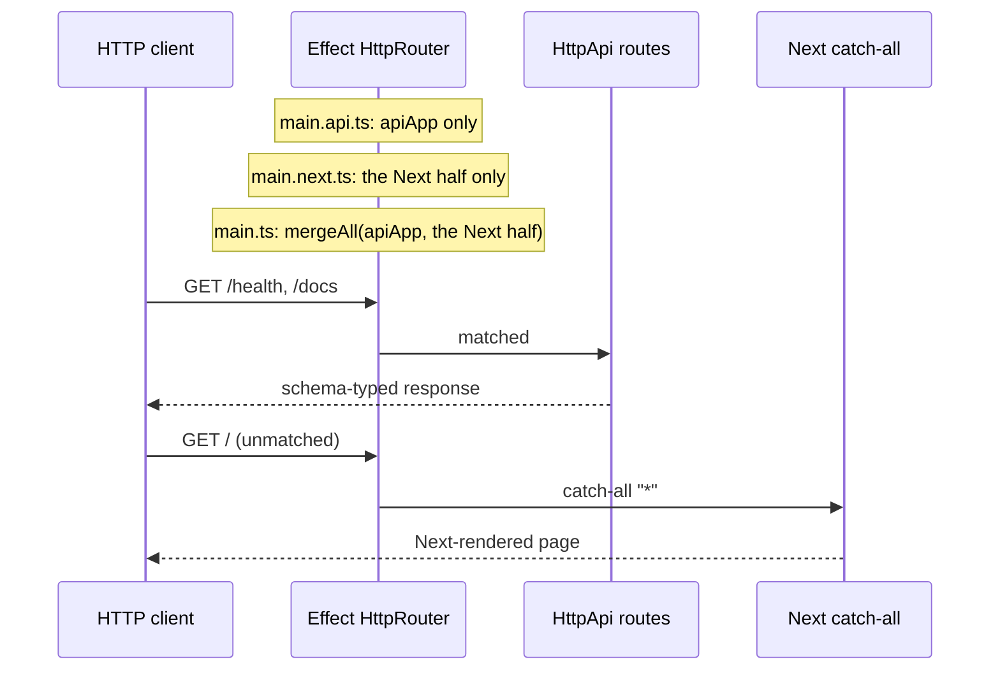

# next-effect-bdd

> **This repository is a proof of concept** for wiring Effect and Next.js
> together. The wiring, seams, and tests are the deliverable; the `Greeter`
> feature driving them is deliberately trivial.

The question: can a Next.js app run **inside a standard Effect HTTP server** —
one router, one runtime, one request context? The answer demonstrated here is
yes:

```ts
const port = yield* layerProd
  .pipe(HttpRouter.provideRequest(Greeter.layerFor(Language.Spanish)), startApp(0));
```



## What the POC proves

- **One server, two frameworks.** Effect's `HttpRouter` owns the Node HTTP
  server; Next.js is a service mounted at `"*"`, and HMR socket upgrades are
  routed through the same router so live refresh works.
- **One request context for both worlds.** Services from
  `HttpRouter.provideRequest` are visible to Effect handlers and — through an
  `AsyncLocalStorage` bridge — to React Server Components and server actions.
- **One contract, three consumers.** Handlers, OpenAPI/Swagger, and the BDD
  test client all derive from the same schema-first `HttpApi`
  (`server/api.ts`), so drift is a compile error.
- **A total mode model.** The environment's `MODE` becomes a composition
  choice at each entry point, made exhaustively over the `Mode` enum:
  a new mode without a branch is a compile error, and programmatic callers
  pick `layerProd`/`layerDev` (or their own `layer(config, routes)`)
  directly.

There are three entry points: `main.next.ts` (Next only), `main.api.ts`
(Effect API only), and the default `main.ts`, which composes both halves on
one router with `Layer.mergeAll`.

## Layout

Dependencies point one way: `app/` and `features/` → `server/` → `domain/`.

```text
domain/greeter.ts      Greeter service and its layerFor mapping
server/config.ts       single source of truth: Mode/Language enums + schemas, AppConfig
server/api.ts          the typed Api contract: HttpApi + handlers + client type
server/apiApp.ts       standalone API app: Api routes + Swagger UI + config
server/nextApp.ts      standalone Next app: layer(config, routes), layerProd, layerDev, HMR routes
server/deps.ts         AsyncLocalStorage bridge from request fibers into renders
server/next.ts         NextJs service and the nextCatchAll route
server/pipeline.ts     serveApp / startApp (HttpRouter.serve over NodeHttpServer)
server/app.ts          the composed app: mergeAll(apiApp, the Next half)
app/page.tsx           Next server component; runs Greeter against the request context
features/              Gherkin features + steps + the programmatic runner
```

## Features

The [effect-bdd](https://github.com/tatemz/effect-bdd) scenarios each make
one narrow claim: the Next-rendered page greets per language, the typed
`/health` API reports the same greeting (called through the generated
`HttpApiClient`, not a raw fetch), and `/docs` + `/openapi.json` are served.
A Playwright scenario proves the shared context: page view, health hit, and
server action all read the *same* `Incrementer` instance.

Every scenario runs against the **production lane**: the `production`
mode serves the built `.next` output, booted and released in-process per
scenario. (The app itself still ships a development lane — `layerDev` and
the `pnpm dev` scripts — but the BDD runner exercises only production.)

## Commands

```sh
pnpm install
pnpm build          # next build (required before start/tests)

pnpm dev            # composed app, with HMR; :next / :api run the variants
pnpm start          # production; start:next / start:api for the variants

pnpm test-bdd       # the whole feature, in one process: builds first
                    # (pretest-bdd), then runs the step module, which
                    # *is* the runner (effect-bdd programmatically, no CLI).
                    # Run once beforehand:
                    #   pnpm exec playwright install chromium
```

`dev` scripts carry their own env; `start` respects `PORT`, `LANGUAGE`, and
`MODE` from the environment (the API variant needs only `PORT` and
`LANGUAGE`).

## Docker

```sh
docker build -t next-effect-bdd .
docker run -d --name next-effect-bdd -p 3000:3000 --stop-timeout 30 next-effect-bdd
curl --fail http://localhost:3000/health
```

A multistage image (`node:24-alpine3.24`, digest-pinned, non-root) runs
`main.ts` as PID 1, keeping Effect's graceful SIGTERM shutdown. Defaults are
`MODE=production`, `PORT=3000`, `LANGUAGE=en`; override with `docker run -e`
(changing `PORT` requires a matching port mapping). Next.js standalone output
is incompatible with this custom server, so the image ships the full
production dependency tree and the `.next` build.

## Requirements

- Node ≥ 22.12 (native TS stripping runs `main.ts` directly)
- `effect` + `@effect/platform-node` `4.0.0-rc.117` (`effect-bdd` tracks the
  v4 release-candidate train)
- `typescript@7` + `@effect/tsgo` — `pnpm exec tsc --noEmit` also reports
  Effect-specific diagnostics
- `playwright` (dev-only) — run `pnpm exec playwright install chromium` once
